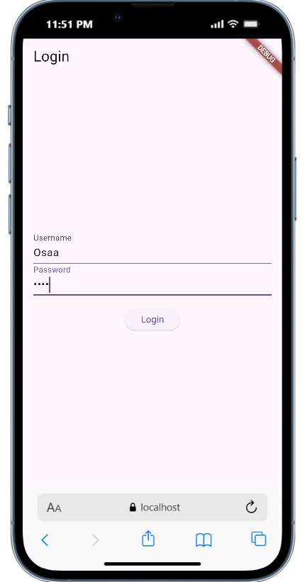
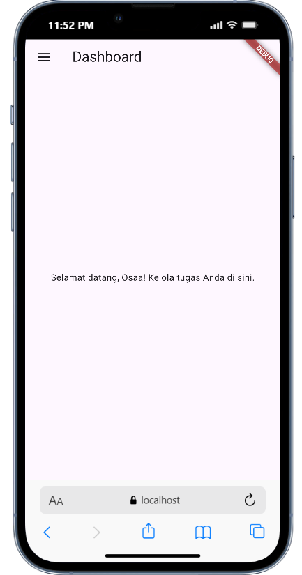
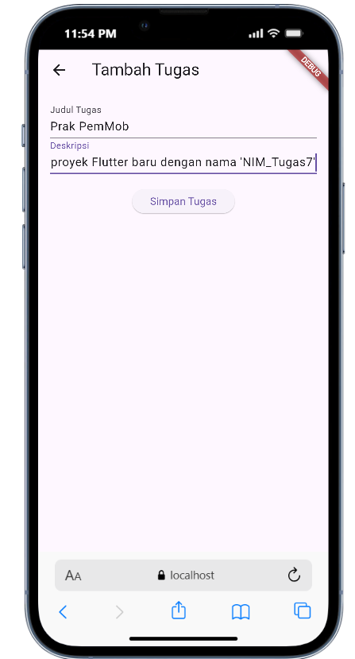
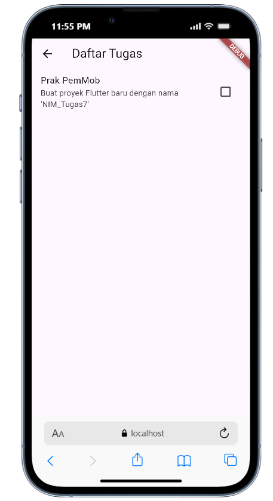
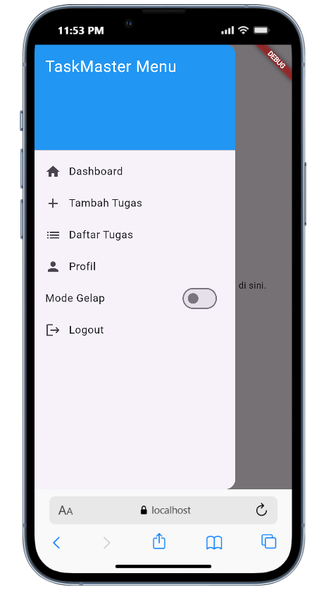
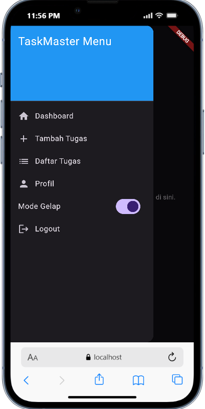

# H1D023069_Tugas7 - Tugas 7 Pertemuan 9 Flutter

## Fitur Utama
- **Login dengan Validasi**: Input username/password minimal 4 karakter, penyimpanan ke local storage.
- **Dashboard (Home)**: Tampilan selamat datang dengan username yang dimuat dari storage.
- **Tambah Tugas**: Form untuk menambah tugas baru, disimpan sebagai list JSON.
- **Daftar Tugas**: List tugas yang bisa ditandai selesai, dimuat dari storage.
- **Profil**: Tampilan username dan password (untuk demo).
- **Side Menu**: Navigasi dengan ikon, toggle tema gelap/terang, dan logout.
- **Animasi dan Tema**: Fade-in pada login, toggle tema menggunakan provider.
- **Local Storage**: Semua data disimpan lokal tanpa database eksternal.

## Screenshot Aplikasi
Berikut adalah screenshot utama aplikasi. Gambar diambil dari emulator Android dan disimpan di folder `assets/images/`.

- **Halaman Login**: Form login dengan animasi fade-in.  
  

- **Dashboard (Home)**: Tampilan utama setelah login, dengan side menu.  
  

- **Tambah Tugas**: Form input tugas baru.  
  

- **Daftar Tugas**: List tugas dengan checkbox untuk status selesai.  
  

- **Side Menu**: Menu navigasi dengan toggle tema.  
  

- **Mode Gelap**: Contoh tampilan dengan tema gelap aktif.  
  

## Penggunaan
1. **Login**: Masukkan username/password >=4 karakter. Jika berhasil, navigasi ke home.
2. **Navigasi**: Gunakan side menu (geser dari kiri) untuk akses halaman lain.
3. **Tambah Tugas**: Dari side menu, pilih "Tambah Tugas" dan isi form.
4. **Lihat Tugas**: Pilih "Daftar Tugas" untuk lihat dan tandai selesai.
5. **Toggle Tema**: Di side menu, aktifkan "Mode Gelap".
6. **Logout**: Hapus data dan kembali ke login.

## Struktur Kode dan Penjelasan Tiap Bagian
Berikut penjelasan tiap file utama:

### lib/main.dart
- **Fungsi**: Entry point aplikasi. Menginisialisasi shared_preferences untuk cek status login, setup provider untuk tema, dan definisi routes.
- **Penjelasan Kode**:
  - `main()`: Load username dari storage untuk tentukan halaman awal (login atau home).
  - `MyApp`: Widget root dengan `MaterialApp`, consumer provider untuk tema, dan map routes ke halaman-halaman.
  - **Kreativitas**: Integrasi provider untuk toggle tema global.

### lib/models/task.dart
- **Fungsi**: Model data untuk tugas, dengan serialisasi JSON.
- **Penjelasan Kode**:
  - Class `Task` dengan properties `title`, `description`, `isCompleted`.
  - Method `toJson()` dan factory `fromJson()` untuk convert ke/dari JSON.
  - **Kreativitas**: Mendukung penyimpanan list tugas sebagai JSON di shared_preferences.

### lib/providers/theme_provider.dart
- **Fungsi**: State management untuk toggle tema gelap/terang.
- **Penjelasan Kode**:
  - Class `ThemeProvider` extends `ChangeNotifier`.
  - Property `_isDarkMode` dan method `toggleTheme()` untuk ubah tema.
  - **Kreativitas**: Menggunakan provider untuk state global, bukan hardcoded.

### lib/widgets/side_menu.dart
- **Fungsi**: Widget drawer untuk navigasi side menu.
- **Penjelasan Kode**:
  - `Drawer` dengan `ListView` berisi `ListTile` untuk tiap opsi (home, add task, dll.).
  - `Consumer<ThemeProvider>` untuk toggle switch tema.
  - Logout: Clear storage dan navigasi ke login.
  - **Kreativitas**: Ikon di tiap item, integrasi tema toggle.

### lib/screens/login_page.dart
- **Fungsi**: Halaman login dengan validasi dan animasi.
- **Penjelasan Kode**:
  - `LoginPageState` dengan `TickerProviderStateMixin` untuk animasi.
  - `_login()`: Validasi input, simpan ke storage, navigasi ke home.
  - `FadeTransition` untuk animasi fade-in pada body.
  - **Kreativitas**: Animasi durasi 1 detik, snackbar untuk error, bukan dialog.

### lib/screens/home_page.dart
- **Fungsi**: Dashboard utama, load username dari storage.
- **Penjelasan Kode**:
  - `_loadUsername()`: Ambil data dari shared_preferences.
  - Body: Text selamat datang dengan username.
  - **Kreativitas**: Load dinamis dari storage, bukan hardcoded.

### lib/screens/add_task_page.dart
- **Fungsi**: Form tambah tugas, simpan ke storage sebagai JSON.
- **Penjelasan Kode**:
  - `_saveTask()`: Validasi, encode task ke JSON, tambah ke list di storage.
  - `Navigator.pop()` untuk kembali setelah simpan.
  - **Kreativitas**: Penyimpanan list JSON, bukan hanya string.

### lib/screens/task_list_page.dart
- **Fungsi**: Tampilkan list tugas dari storage.
- **Penjelasan Kode**:
  - `_loadTasks()`: Decode JSON dari storage ke list `Task`.
  - `ListView.builder` dengan `Checkbox` untuk toggle `isCompleted`.
  - **Kreativitas**: Load dan tampil dinamis, checkbox interaktif.

### lib/screens/profile_page.dart
- **Fungsi**: Tampil profil user (username dan password).
- **Penjelasan Kode**:
  - `_loadProfile()`: Load dari storage.
  - Body: Text sederhana untuk username dan password.
  - **Kreativitas**: Demo penyimpanan password (dalam produksi, hash!).

### pubspec.yaml
- **Fungsi**: Konfigurasi proyek dan dependencies.
- **Penjelasan Kode**:
  - Dependencies: `shared_preferences`, `provider`.
  - Flutter config: `uses-material-design: true`.
  - **Kreativitas**: Tambah provider untuk tema.
